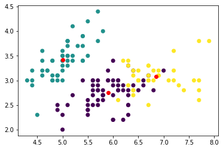
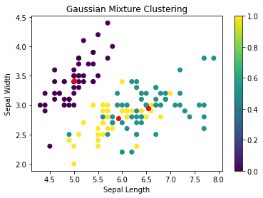
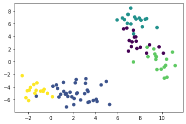
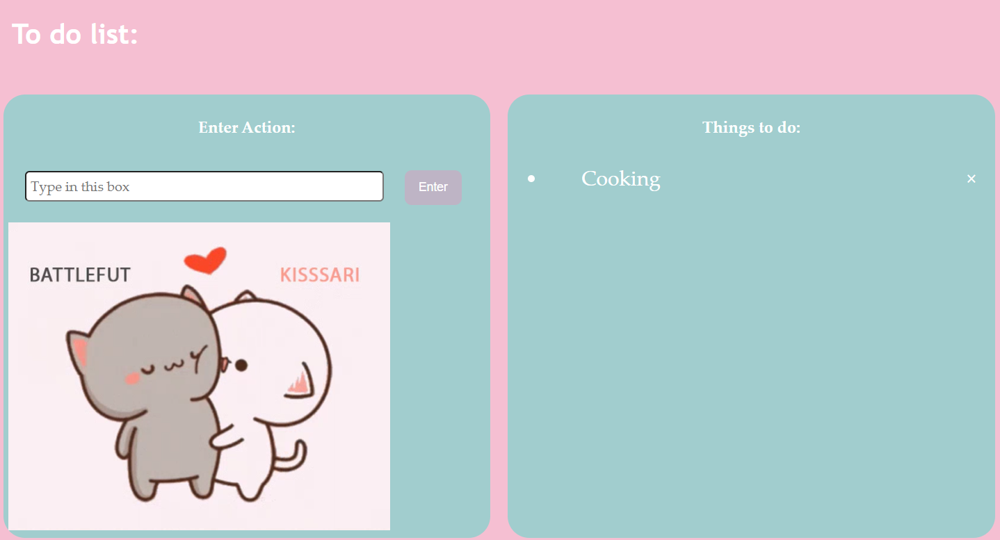
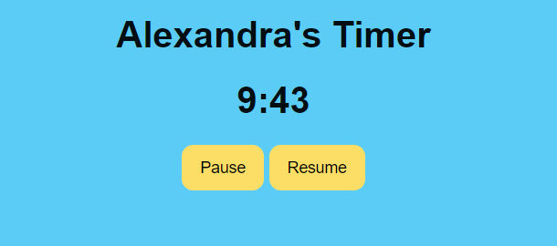

# Hi there, my name is Alexandra Marie Tribe (Sasha for short)👋

## Technologies I have worked with

### Python
#### Machine Learning

Imported sklearn libraries to implement kmeans clustering and used matplotlib to visualise the result of applying the method onto iris dataset.

*May need to change to light mode to view the axis labels*

- Each red dot presents a cluster centre and each colour presents a cluster

Gaussian Mixture Clustering:

This is the result when we changed the number of clusters to be 5:

PCA and Linear Discriminant Analysis

### HTML, CSS, JS:
#### A basic To-do list:

Allows you to:
 - Add an item then display on to do list
 - Delete an item in the to-do list
 - Check the item in the to-do list

#### A Basic Timer:

**Starts timer from 10 minutes down.**

Allows you to:
    - You can pause the timer
    - You can resume the time

- 🔭 I’m currently working on making a dashboard with Power BI
- 🌱 I’m currently learning about data visualisation
- 👯 I’m looking to collaborate python backend applications
- 💬 Ask me about Python, machine learning, python visualisation packages,
- 📫 How to reach me: 
    - [Click here for my LinkedIn](https://www.linkedin.com/in/alexandra-tribe-8283a5257)

